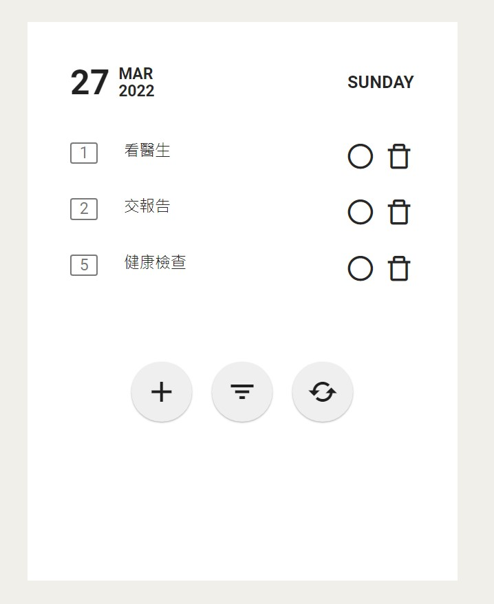
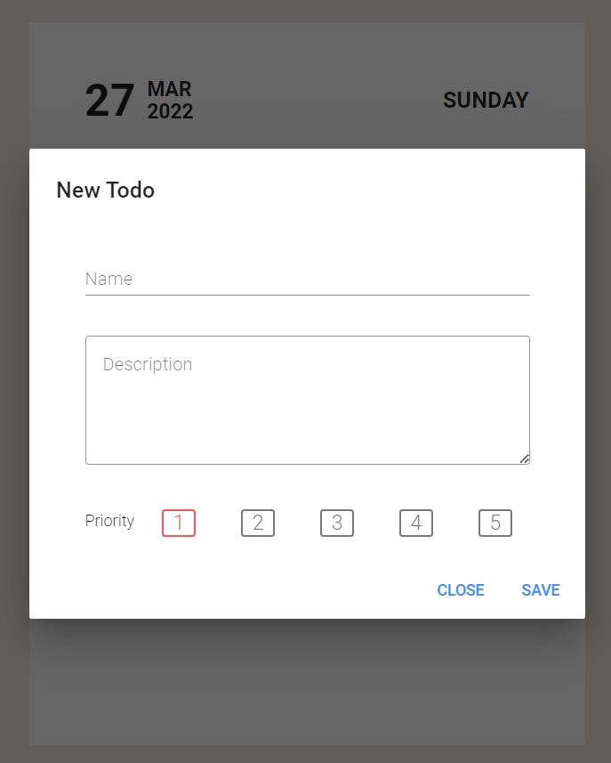
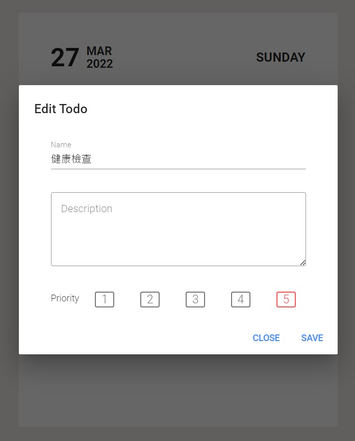
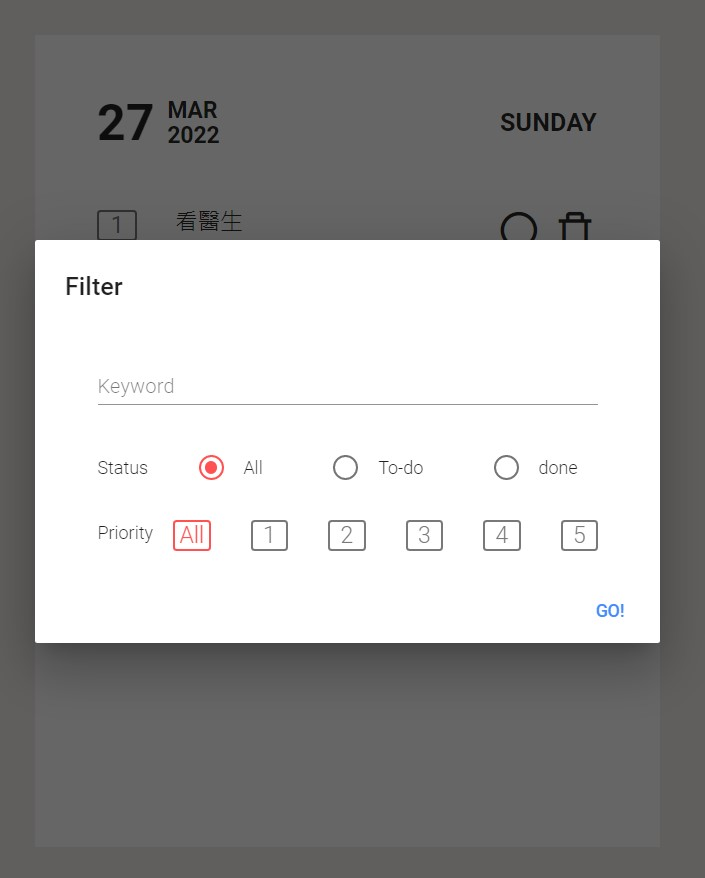

# to-do-list
A To-Do List with features like create, edit, filter, prioritize
- frontend：Vue.js
- backend：Typescript + Express
- database：MongoDB

### **Install Dependency**

```bash
npm install
```

### Ru**n the project**

```bash
# build
npm run build

# watch mode
npm run start
```

### Unit Test

```bash
npm run test
```

## ****Project preview****

Home page



New todo page



Edit todo page



Filter page

